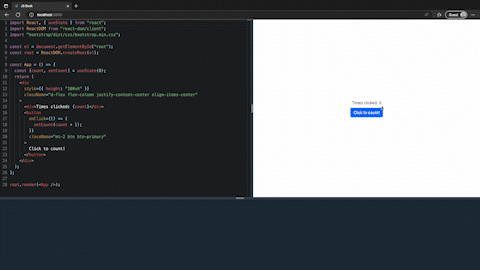
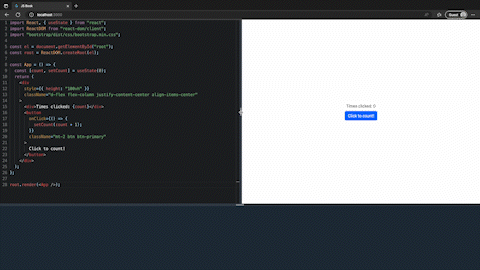
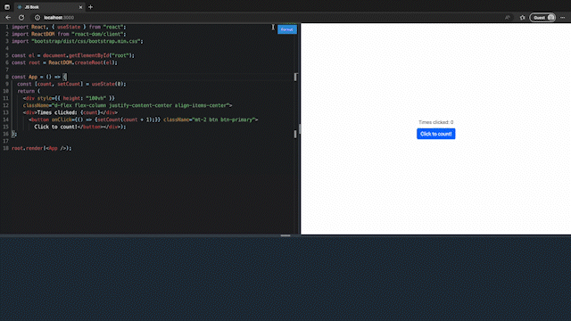

# JBook

Get your JavaScript code running directly on your web browser

## Features

### Import libraries without having to install them

### Fully resizable component

### Format your code with one click

## To be implemented

I am currently working on a similar implementation to write markdown and get a preview side-by-side
